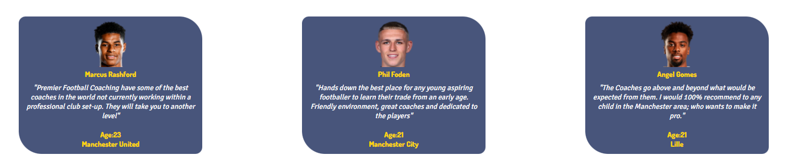
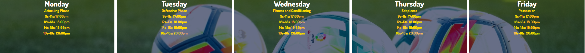

# Welcome!

Premier Football Coaching is a fictional football coaching site, based in Manchester, which offers children, from age 9 up to teenagers aged 18, the chance to be coached by top level ex-academy football coaches for a chance to be scouted by professional football clubs. It will attract former academy players as well, hoping to restart their footballing asperations. The name was created to resemble the elite level of english football; The Premier League. 

This site will provide potential players and their parents information about the coaches, provide testimonials from current professional players, times sessions are available and location and the ability to sign up.  

## Final Design

---

### [Here is a link to the final project](https://benlamb95.github.io/premier-football/)

---
## CONTENTS

* [UX/UI](#ux)
    * [USERSTORIES](#user-stories)

* [WIREFRAMES](#wireframes)

* [FEATURES](#features)
  * [COLOURS](#colours)
  * [FONT](#font)

* [TESTING](#testing)
  * [DEVICES](#devices)
  * [VALIDATORS](#validators)
  * [LIGHTHOUSE](#lighthouse)

* [SOLVED BUGS AND ERRORS](#solved-bugs-and-errors)
   
* [UNSOLVED BUGS AND ERRORS](#unsolved-bugs-and-errors)

* [LANGUAGES USED](#languages-used)
    * [PROGRAMS USED](#programs-used)
    
* DEPLOYMENT

* [Credits](#credits)

* [Content](#content)

* [Media](#media)

* [Other-Sources](#other-sources)

   
---
## UX
* This website was created to show my knowledge of HTML and CSS and to provide users with visual and educational content
* The site should be simple to navigate
* Users should be able to use their own initiative and progress through the website in their own way
* The user will have feedback from their actions
* The site should be easy to read with no punctuation errors and images should be clear without stretching or squashing
* The site to be suitable for a range of screen widths and devices

* Site Goals:
    * To showcase my skills in HTML and CSS
    * To provide users with an easy to understand website
    * Information on the site to be clear and unambiguous
    * The images and colours to be eye catching 
    * To follow a consistent design style throughout the site
 
 ---   
## User Stories
* As a user, I want be able to understand the information presented and leave me with no further questions
* As a user, I want to understand the main purpose of the site
* As a user, I want to be able to navigate through the site easily and provided constant feedback
* As a user, I want the site to be attractive to look at
* As a user, I want to be drawn into signing up for the football training
* As a user, I want view images and see videos of the work that is done at Premier FC
* As a user, I want social media links to be able to keep upto date with the latest information.
---

## Wireframes

---

To help plan my site I used Balsamiq to create wireframes. Desktop version can be viewed below:

[Desktop-index](documents/wireframes/index-wireframe.PNG)

[Desktop-Coaches](documents/wireframes/coaches-wireframe.PNG)

[Desktop-Prices](documents/wireframes/timetable-wireframe.PNG)

[Desktop-signup](documents/wireframes/signup-wireframe.PNG)

Mobile version can be viewed below:

[Mobile-index](documents/wireframes/mobile-index.PNG)

[Mobile-coaches](documents/wireframes/coaches-phone.PNG)

[Mobile-prices](documents/wireframes/timetable-phone.PNG)

[Mobile-signup](documents/wireframes/signup-phone.PNG)

## FEATURES

---

The site consists of 4 main pages; Home/Index page, Coaches, Prices and sessions, Sign-up and additionally a thank you page once the user has submitted the form. 

Each page follows a similar design style for all devices which includes a Navigation bar- containing a logo and navigation links, Internal buttons linking to other pages towards the bottom of each page and a footer for social media links, terms and conditions.

* Navigation bar
  * Identical on all pages for easy navigation
  * Hover effect on links to ensure user is given feedbak and they know where they are positioned on the screen.

* Smaller device Navigation bar

* Internal buttons 
  * Feature on all pages except once user on that specific page the button will not appear; same style and size with hover effect turning the background colour slightly darker for user feedback.

* Footer
  * Again consistent in style and ccolour featuring social media links that open in a new browser tab.

## Home page

* The home page consists of a landing page image which scales in the picture slighlty upon arrival to catch the users attention.
* It also has a rhetorical question to again peak the users attention.

* Initial text introduces the users to who Premier football coaching are and what they do, tied in with a video for a greater user experience.

* It contains testimonals from current proffessional football players wrapped in a box consistent in shape and colour with hover effect on Nav bar and text on main image.

## Coaches Page

* Coaches page was designed to be eye catching a resemble a football card e.g. Panini sticker. Again the background colour and shape is the same as elements mentioned previously.
* Cards increase in size slighlty when hovered over

* YouTube video features again under the coaches information to provide users and insght of a training session.
* This should encourage users knowledge of how sessions are done and should prompt excitement.

## Prices and sessions Page

* This page is sectioned into 3 main parts, Prices, training sessions and then location.
  * Prices section is just information about how much each session costs, terms of when a session is booked and plyer safety.

* The session section contain an image divided into 5 equal segments all containing information about the day, session type, times and age group.

* The location section is a google map with the specified location already input, where customers can interact with the map and take directions.

## Sign up Page

* The sign up form takes president of the full screen intially with an attractive picture behind it
 * Sign up form requires all fields to be filled out to be able to submit

 

 * Below the sign up form is contact information inlcuding phone, email and address.

 ## Thank you page

 * This is a very basic page containing a bakground image and overlaying text confirming the form has been submitted. 

---

## COLOURS
  * For my site I used 4 main colours. Gold (#FFD700), Dark Blue (rgba(26, 42, 90, .8), #303159) and white and black.
  * The gold was used to represent quality hence the name Premier but also be eye catching and stand out.
  * The dark blue was a good colour contrast and also a powerful colour. I used both hex and RGBA values as in some cases i required the colour opacity to fade on images.
  * White was present through for white space and black as it contrast's well and is easy to read. 

## FONT 
  * The fonts I used within my site was Dosis for headings and signika for main body text, with back up fonts of Sans-serif. These fonts were located from Google fonts and imported oat the top of the CSS file.

  ---

## TESTING

### Devices

* I have tested my website on the following devices:

  * Apple
    * iPhone X
    * iPhone 8 plus
    * iPhone 11 Max
    * iPhone 13 Max
    * iPad Pro
    * Mac Book 

  * Laptops/Desktops
    * Dell Inspiron 15 5000
    * HP Pavilion 14
    * LG Display screen 32inch

  * Android 
    * Huawei P40

  * Browsers
    * Chrome
    * Edge
    * Safari
    * Firefox

## VALIDATORS
* I ran my HTML code through W3 HTML validator and received some errors.
  * I had used in line styling for i frame which required changing via CSS
  * The use of H1 within my page which i corrected with a h2 and increased font size. 
  * i had used an id for multiple divs so i removed these and instead used class selector.
* Once updates completed by me checked again and no errors found.

* I ran my CSS code through W3C CSS Validator. Initially i recieved some errors. 
  * Due to incorrect spacing between numbers and px values which I corrected.
  * I had used the incorrect flex direction again corrected.
  * I also removed code not needed for my google map.  
* Once updates completed by me checked again and no errors found.

---

## Lighthouse

---

### Home

### Coaches

### Prices & Sessions

### Sign-Up

### Thankyou

## Solved Bugs and Errors

## Unsolved Bugs and Errors

## Languages Used

* [HTML](https://en.wikipedia.org/wiki/HTML5)
* [CSS](https://en.wikipedia.org/wiki/CSS#CSS_3)

## Programs Used

* GIT
  * For version control.
* GITPOD
  * The IDE to code this site.
* GITHUB
  * Used to store repositories.
* CHROME Developer tools
  * For checking responsiveness while coding, correcting errors and editing code.
* Am I Responsive
  * Used to test responsiveness of the final website at different screen sizes.
* Balsamiq
  * Used to create Wireframes for intial designs for desktop and mobile.

## Credits

* @OkwudiriOkoro- My mentor has been a huge help throughout this project. Providing much needed experience and guidance.
* The slack community for their constant support 24/7. Providing valuable help and feedback from people in ranging positions such as fellow students.
* And of course the Code Institute programme, which has took me from a complete novice in coding to someone who now can write and read HTML and CSS in just 1 month. 

## Content

* The content found within the prices section came from website Coachability
* Icons located from fontawesome
* Click effect on internal buttons source code from W3school
* The coaches cards layout came from help on stackoverflow

## Media
* YouTube video on index page came from UK trials official YouTube site. 
* YouTube video on coaches page came from luismedinalm79 channel
* Marcus Rashford, Angel Gomes and Phil Foden image located via google images from football manager 22 game.
* All coaches located from Istockphoto via a free download
* Hero image with players playing football, prices and timetable image split into 5 sections, sign up page image and thank-you page image all from unsplash.com which again allows the use of free images. 
* Scale of image on index page inspiration came from Codeinstitute Love Running project

## Other-Sources
* Responsive navigation bar came from a youtube channel called CodingNepal
* Kevin Powell YouTube video on how to fix header and footer position
* CSS tricks website for a guide to flexbox
